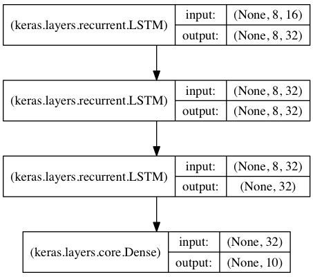

## 操作技巧梳理

### 基于栈式的LSTM分分类

参考：[Keras中文文档](https://keras.io/zh/getting-started/sequential-model-guide/)

在这个模型中，我们将 3 个 LSTM 层叠在一起，使模型能够学习更高层次的时间表示。

前两个 LSTM 返回完整的输出序列，但最后一个只返回输出序列的最后一步，从而降低了时间维度（即将输入序列转换成单个向量）。



```python
from keras.models import Sequential
from keras.layers import LSTM, Dense
import numpy as np

data_dim = 16
timesteps = 8
num_classes = 10

# 期望输入数据尺寸: (batch_size, timesteps, data_dim)
model = Sequential()
model.add(LSTM(32, return_sequences=True,
               input_shape=(timesteps, data_dim)))  # 返回维度为 32 的向量序列
model.add(LSTM(32, return_sequences=True))  # 返回维度为 32 的向量序列
model.add(LSTM(32))  # 返回维度为 32 的单个向量
model.add(Dense(10, activation='softmax'))

model.compile(loss='categorical_crossentropy',
              optimizer='rmsprop',
              metrics=['accuracy'])

# 生成虚拟训练数据
x_train = np.random.random((1000, timesteps, data_dim))
y_train = np.random.random((1000, num_classes))

# 生成虚拟验证数据
x_val = np.random.random((100, timesteps, data_dim))
y_val = np.random.random((100, num_classes))

model.fit(x_train, y_train,
          batch_size=64, epochs=5,
          validation_data=(x_val, y_val))
```
```
输入尺寸

3D 张量，尺寸为 (batch_size, timesteps, input_dim)。

输出尺寸

如果 return_state 为 True，则返回张量列表。 第一个张量为输出。剩余的张量为最后的状态， 每个张量的尺寸为 (batch_size, units)。
否则，返回尺寸为 (batch_size, units) 的 2D 张量。
```
### 其他

- `KeyeVectors`读取预训练的词向量

```python
import gensim
from gensim.models import KeyedVectors

word2vec_model_path = './data/data_vec.txt' ##词向量文件的位置
word2vec_model = KeyedVectors.load_word2vec_format(word2vec_model_path, binary=False,unicode_errors='ignore')
word2vec_dict = {}
for word, vector in zip(word2vec_model.vocab, word2vec_model.vectors):
    if '.bin' not in word2vec_model_path:
        word2vec_dict[word] = vector
    else:
        word2vec_dict[word] = vector /np.linalg.norm(vector)
for each in word2vec_dict:
    print (each,word2vec_dict[each])
# ---------------------
# 原文：https://blog.csdn.net/yangfengling1023/article/details/81705109
```
- use `tqdm` to see progress bar
```python
import tqdm
```
- split句子的简洁方法
```python
sentences = train["question_text"].progress_apply(lambda x: x.split()).values

```
- 生成数组
```python
import numy as np
# 均值100，方差2，大小为5*10
embedding_matrix = np.random.normal(100, 2, (5, 10))

```

- python闭包
```python
def ex_func(n):
	sum = n
	def ins_func():
		return sum+1
	return ins_func
f = ex_func(10)
f() # == 11

```

- 小数位数
```python

```

- 通过F1-Score选择sigmoid阈值
```python
from sklearn import metrics
# 将验证集的二维输入的text转化为三维的张量形式，取前3000
val_vects = np.array([text_to_vec(X_text) for X_text in tqdm(val_df["question_text"][:10000])])
val_y = np.array(val_df["target"][:10000])
pred_glove_val_y = model.predict([val_vects], batch_size=1024, verbose=1)

for thresh in np.arange(0.1, 0.501, 0.01):
    thresh = np.round(thresh, 2)
    print("F1 score at threshold {0} is {1}"
          .format(thresh, metrics.f1_score(val_y, (pred_glove_val_y>thresh).astype(int))))

```


- learn embeddings from scratch (from CNN_for_NLP)
```python
from keras.preprocessing import text, sequence

# 取训练集和测试集的所有query
X_train = train["question_text"].fillna("fillna").values
y_train = train["target"].values
X_test = test["question_text"].fillna("fillna").values

# 单词上限:
max_features = 40000
# sequence length:
maxlen = 70
# embedding_size:
embed_size = 300

# 初始化一个Tokenizer(),设置单词的上限
tokenizer = text.Tokenizer(num_words=max_features)
# 训练所有query里面的单词，结果是将单词按频率编号
tokenizer.fit_on_texts(list(X_train) + list(X_test))
# 将训练集X_train和测试集X_test转化为index(编号)的形式
X_train = tokenizer.texts_to_sequences(X_train)
X_test = tokenizer.texts_to_sequences(X_test)
# 将训练集、测试集的长度补齐
x_train = sequence.pad_sequences(X_train, maxlen=maxlen)
x_test = sequence.pad_sequences(X_test, maxlen=maxlen)
```
example:
```
input query:
 ['How did Quebec nationalists see their province as a nation in the 1960s?', 'Do you have an adopted dog, how would you encourage people to adopt and not shop?', 'Why does velocity affect time? Does velocity affect space geometry?', 'How did Otto von Guericke used the Magdeburg hemispheres?', 'Can I convert montra helicon D to a mountain bike by just changing the tyres?']

text to sequence:
 [[1, 3, 10, 11, 12, 13, 14, 15, 4, 16, 17, 2, 18], [19, 5, 20, 21, 22, 23, 1, 24, 5, 25, 26, 6, 27, 28, 29, 30], [31, 7, 8, 9, 32, 7, 8, 9, 33, 34], [1, 3, 35, 36, 37, 38, 2, 39, 40], [41, 42, 43, 44, 45, 46, 6, 4, 47, 48, 49, 50, 51, 2, 52]]

pad sequence:
 [[ 0  0  0  0  0  0  0  0  0  0  0  0  0  0  0  0  0  0  0  0  0  0  0  0
   0  0  0  0  0  0  0  0  0  0  0  0  0  0  0  0  0  0  0  0  0  0  0  0
   0  0  0  0  0  0  0  0  0  0  0  0  0  0  0  0  0  0  0  0  0  0  0  0
   0  0  0  0  0  0  0  0  0  0  0  0  0  0  0  1  3 10 11 12 13 14 15  4
  16 17  2 18]
 [ 0  0  0  0  0  0  0  0  0  0  0  0  0  0  0  0  0  0  0  0  0  0  0  0
   0  0  0  0  0  0  0  0  0  0  0  0  0  0  0  0  0  0  0  0  0  0  0  0
   0  0  0  0  0  0  0  0  0  0  0  0  0  0  0  0  0  0  0  0  0  0  0  0
   0  0  0  0  0  0  0  0  0  0  0  0 19  5 20 21 22 23  1 24  5 25 26  6
  27 28 29 30]
 [ 0  0  0  0  0  0  0  0  0  0  0  0  0  0  0  0  0  0  0  0  0  0  0  0
   0  0  0  0  0  0  0  0  0  0  0  0  0  0  0  0  0  0  0  0  0  0  0  0
   0  0  0  0  0  0  0  0  0  0  0  0  0  0  0  0  0  0  0  0  0  0  0  0
   0  0  0  0  0  0  0  0  0  0  0  0  0  0  0  0  0  0 31  7  8  9 32  7
   8  9 33 34]
 [ 0  0  0  0  0  0  0  0  0  0  0  0  0  0  0  0  0  0  0  0  0  0  0  0
   0  0  0  0  0  0  0  0  0  0  0  0  0  0  0  0  0  0  0  0  0  0  0  0
   0  0  0  0  0  0  0  0  0  0  0  0  0  0  0  0  0  0  0  0  0  0  0  0
   0  0  0  0  0  0  0  0  0  0  0  0  0  0  0  0  0  0  0  1  3 35 36 37
  38  2 39 40]
 [ 0  0  0  0  0  0  0  0  0  0  0  0  0  0  0  0  0  0  0  0  0  0  0  0
   0  0  0  0  0  0  0  0  0  0  0  0  0  0  0  0  0  0  0  0  0  0  0  0
   0  0  0  0  0  0  0  0  0  0  0  0  0  0  0  0  0  0  0  0  0  0  0  0
   0  0  0  0  0  0  0  0  0  0  0  0  0 41 42 43 44 45 46  6  4 47 48 49
  50 51  2 52]]

```